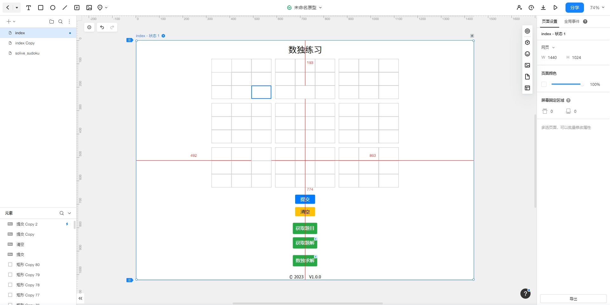
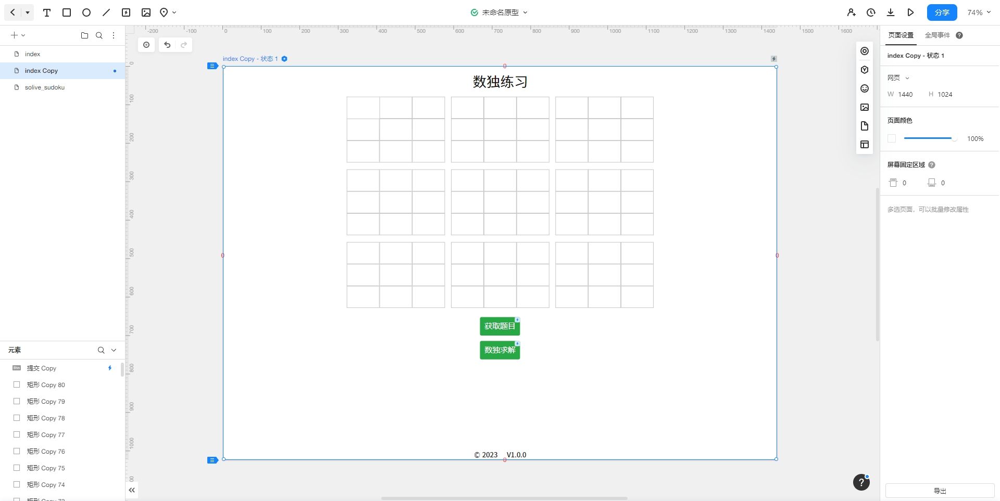
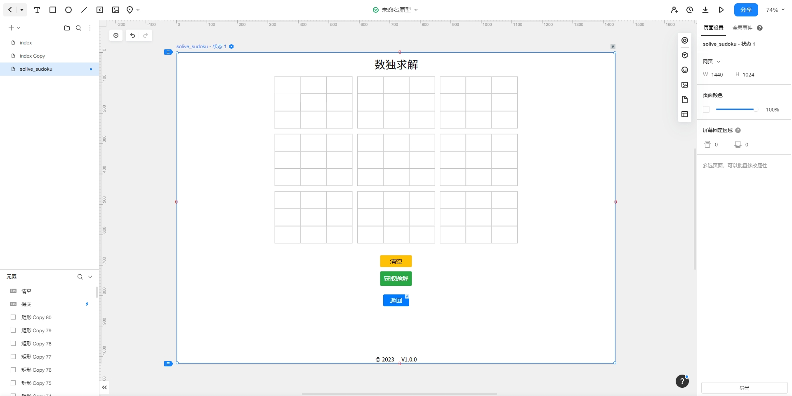
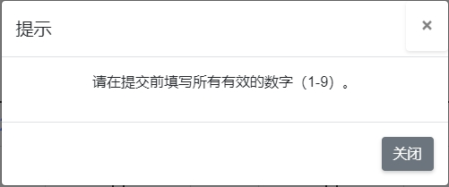

# 2023秋软工实践 第二次结对编程作业

| 这个作业属于哪个课程  |                   [班级链接](https://bbs.csdn.net/forums/fzusdn-0831?typeId=4994744)                   |
|:-----------:|:--------------------------------------------------------------------------------------------------:|
|  这个作业要求在哪里  |                           [作业链接](https://bbs.csdn.net/topics/617335682)                            |
|    个人学号     |                                             112100821                                              |
|   结对成员学号    |                                             102101325                                              |
| GitHub 仓库地址 |                         [GitHub仓库](https://github.com/Andy-boy123/auto_sudoku)                          |

# 作业要求

## 背景
第一次结对编程作业，你已经完成了9个九宫格数独的并发生成。jason哥能迅速求解9个数独，求解速度极快，已经没有了人类对手，于是需要你用一定的算法来并发求解9个数独，和jason哥比比求解的速度。注意，必须实现并发求解，而非串行求解，否则求解速度差距悬殊太大啦。

## 实现要求
本次作业要求基于第一次结对编程作业继续完成，请完成一个“9个九宫格数独生成和求解”网页端或APP的开发。
- 代码实现。在第一次结对编程作业的基础上，完善相关的功能，9个九宫格数独的并发求解，特别注意，必须使用并发技术生成和求解9个数独，而不是串行生成和求解。你可能需要学习多线程或多进程、并发数据结构、调优和性能测试等技术，将实现的代码上传至GitHub，并在上传代码的仓库的README.md中写清楚运行代码的方法，方便助教检查。
- 界面要求
  - 设计美观。UI 设计规范统一，美观精致
  - 用户易懂易用，符合主流人群的使用习惯。
- 功能要求
  - 并发生成可解的9个九宫格数独个数。
  - 并发求解生成的9个九宫格数独。
- 附加分
  - 不仅支持系统并发求解，还可以用户输入求解数独。
  - 针对用户的求解给出提出性信息（求解正确或错误，哪一行那一列不符合数独要求等）。

## 编码要求
- 制定合适的代码规范，进行测试。
- 使用 git 进行版本控制，两个人要通过 git 协作方式完成编码。两个都要有代码编写和相应的单元测试。

## 博客要求
- 结对的两名同学都需要提交作业，一名同学的博客为完整内容，另一名同学的博客只需要附上完整内容博客链接。
- 基础格式要求
  - 标记结对两个人的学号姓名信息（结对作业两人都需提交，内容的组织可有不同）。
  - 记录本次作业的PSP表格，包括预估耗时和实际耗时。
  - 给出你认为的是重点或难点功能、编程思考，至少2点。
  - 详细写出运用的算法和技术，包括并发性求解算法等。
  - 实现代码的GitHub链接，注意仓库要设置为公开，方便助教检查。
  - 给出照片若干张，包括纸画原型、结对的同学、工作地点、计算机等，可选项包括其他能表达结对编程工作经历的物品或场景。
  - 给出至少3项在编码、争论、复审等活动中花费时间较长，给你较大收获的事件。
  - 总结本次作业，遇到的难点以及如何解决、第二次结对编程的体验等等，两位同学分别总结。
>注：数独求解的相关算法可供参考，但注意，本次作业要求的是9个数独的并发生成和并发求解 <br>
1.https://github.com/Riroaki/Auto-Sudoku-Player <br>
2.https://github.com/wenzihan/SudokuProject <br>
3.https://github.com/oahzxl/SatDpllBaseline

## 评分白标准
- 功能实用性（30）——是否具备基础功能 并发求解9个可解的九宫格数独
- 创新度（10）——是否具备自己的创新点。
- 界面美化度（10）——界面是否逻辑清晰，界面美观。
- 博客描述（40）——是否按要求编写作业内容，以及描述规范。
- 代码规范（5）
- git commit 信息规范，两个人要通过 git 协作方式完成编码。（5）

# 项目结构
    .
    ├── README.md
    ├── app.py
    ├── sudoku_generator.py
    ├── static
    │   ├── style.css
    │   └── script.js
    │   └── solve_sudoku_style.css
    │   └── solve_sudoku_script.js
    ├── img
    └── templates
        ├── index.html
        └── solve_sudoku.html

# 项目部署
使用python flask框架进行项目编程，在完成项目编程之后，将项目文件打包上传至服务器， 在服务器使用命令行运行app.py文件，即可在服务器上部署该项目。
> **[在线预览](http://shudu.andylive.cn/)**

# 应用需求分析

### 背景
第一次结对编程作业，你已经完成了9个九宫格数独的并发生成。jason哥能迅速求解9个数独，求解速度极快，已经没有了人类对手，于是需要你用一定的算法来并发求解9个数独，和jason哥比比求解的速度。注意，必须实现并发求解，而非串行求解，否则求解速度差距悬殊太大啦。

### 需求分析

#### NAB-CD模型

##### Need（需求）
- 在第一次结对编程作业基础上完成，增加对9个九宫格数独的并发求解。
- 界面设计美观，UI设计规范统一，美观精致。
- 用户易懂易用，符合主流人群的使用习惯。
- 不仅支持系统并发求解，还可以用户输入求解数独。
- 针对用户的求解给出提出性信息（求解正确或错误，哪一行那一列不符合数独要求等）。

##### Approach（方法）
使用并发技术生成9个九宫格数独，而不是串行生成，保证所生成数独的可解性；并发技术为数独求解提供性能保证。

##### Benefit（好处）
为用户解决数独难题，同时为用户提供数独训练，提高游戏难度和娱乐性，锻炼玩家思维，减少玩家等待时间。

##### Competitors（竞争）
目前市面上的数独游戏大多数都是串行生成数独，而不是并发生成数独，因此本应用具有一定的竞争优势。

##### Delivery（交付）
本应用将在网页端上实现，用户可以通过浏览器或手机进行访问，同时可以进行数独练习、数独求解等操作。


# PSP表格
|           Personal Software Process Stages            | 预估耗时（分钟） | 实际耗时（分钟） |
|:-----------------------------------------------------:|:--------:|:--------:|
|                     Planning（计划）                      |    45    |    30    |
|                    Estimate（估计时间）                     |   120    |   180    |
|                    Development（开发）                    |   100    |   120    |
|                Analysis（需求分析（包括学习新技术）                 |    60    |    60    |
|                     Design（具体设计）                      |   100    |    90    |
|                     Coding（具体编码）                      |   480    |   420    |
|                Test（测试（自我测试，修改代码，提交修改）                |   100    |   160    |
| Postmortem & Process Improvement Plan（事后总结，并提出过程改进计划） |    45    |    45    |
|                       Total（合计）                       |   1050   |   1105   |


# 原型设计

>原型模型设计工具：[墨刀](https://modao.cc/app/J3UDnZborjqrrdeuDG51nm)





# 运用技术与方法

## 并发求解算法
该项目采用了线程（threading）来实现并发性。在 app.py 中使用了 threading.Lock() 来创建了一个线程锁 solve_lock ，
以确保在多线程环境下求解数独时不会出现竞争条件。
具体来说，在 /get_answer 路由处理函数中：

```python
@app.route('/get_answer', methods=['POST'])
def get_answer_endpoint():
    user_sudoku = request.json.get('userSudoku')  # 获取用户当前的数独谜题
    # 使用锁以确保多个线程不会同时求解数独
    with solve_lock:
        solved_sudoku = solve_sudoku_1(user_sudoku)
    return jsonify({'answer': solved_sudoku})  # 返回数独答案
```

## 用户提交合法性检查
在数独练习用户点击**提交**或者数独求解用户点击**获取题解**后，应用会在前端对用户提交的数独谜题或者数独答案进行合法性检查，
以确保用户提交的数独谜题或者答案是合法的。
如果用户提交的数独谜题或者答案不合法，应用会在前端弹出提示框，提示用户提交的数独谜题或者答案不合法。

  

## 防止用户作弊
当用户点击**获取题解**后**提交**按钮将消失，防止用户作弊。

## 前后端通讯
前后端通过json消息进行通讯，以下是一个例子。实现方法是在前端使用fetch函数，后端使用flask的request.json.get()函数。
```javascript
fetch('/generate_sudoku')
            .then(response => response.json())
            .then(data => {
```
```python
@app.route('/validate_solution', methods=['POST'])
def validate_solution():
    user_solution = request.json.get('solution')  # 获取用户提交的答案

    print(user_solution)  # 打印用户提交的答案

    # 在这里调用答案验证的函数，验证用户答案是否正确
    is_correct = is_valid_solution(initial_sudoku, user_solution)  # is_valid_solution 是验证函数

    return jsonify({'valid': is_correct})  # 返回验证结果
```

## 提示框美化
使用了模态框来实现提示框，使提示框更加美观。
```html
<!-- 验证模态框 -->
    <div class="modal fade" id="validationModal" tabindex="-1" role="dialog" aria-labelledby="exampleModalLabel" aria-hidden="true">
        <div class="modal-dialog" role="document">
            <div class="modal-content">
                <div class="modal-header">
                    <h5 class="modal-title" id="exampleModalLabel">提示</h5>
                    <button type="button" class="close" data-dismiss="modal" aria-label="Close">
                        <span aria-hidden="true">&times;</span>
                    </button>
                </div>
                <div class="modal-body">
                    <p id="validationResult"></p>
                </div>
                <div class="modal-footer">
                    <button type="button" class="btn btn-secondary" data-dismiss="modal">关闭</button>
                </div>
            </div>
        </div>
    </div>
```

## 多端适配
针对移动端，使用了bootstrap框架进行移动端适配，使应用可以在移动端正常运行。同时在CSS样式中尽可能使用了相对单位，使应用可以在不同的屏幕上正常运行。

## 一些细节
在数独练习和数独求解中中，当用户点击获取题解后，新出现的答案会以黑色字体出现，而原题目则保持蓝色字体，以便用户区分。同时用户将无法改动任何一个格子，防止用户作弊。

# GitHub仓库地址
> [GitHub仓库](https://github.com/Andy-boy123/auto_sudoku)

# 照片
>由于国庆假期结对的两个同学没有留校，所以我们采用了线上协作的方式，在腾讯会议中共享桌面进行结对编程。


# 总结
## 一些问题
html中使用了外部js库，但是所引用的谷歌服务器在国内无法访问，因此在国内无法正常使用该应用（需要长时间的加载），需要使用代理才能正常使用该应用。
后面经排查发现后将地址换源为国内镜像站或者nginx反向代理站，访问速度就会快很多，但是仍然不够理想，这是待解决的。

## 112100821陈力恒 总结
通过本次软件工程结对作业，进一步了解了使用js进行前后端通讯的方式和python并发线程的知识，同时利用js我们可以在前端实现非常多的逻辑。
还学会如何将UI设计的稍微美观些，同时也学会了如何使用flask框架进行项目编程，以及如何将项目部署到服务器上，对flask框架有了进一步了解，对路由有了更深的认识。
虽然在一开始对前后端的通讯不是非常了解一直出错，后面我利用浏览器的开发者工具进行调试，同时在后端控制台打印出前端传来的数据，才发现是前后端通讯出了问题，
经过不断地调试处理，最终解决了问题。与此同时，我也学会了如何使用git进行版本控制，如何使用git进行协作编程，如何使用git进行代码提交，如何使用git进行代码回滚等等。
我也学会了如何使用墨刀进行原型设计，如何使用markdown进行文档编写，如何使用markdown进行文档排版等等。
最后与同伴一起结对编程更加考验两个人的协作能力，特别是两个人代码风格不同、风格不同，我们一个人主要负责前端，一个人主要负责后端，但在最后我们要进行代码合并时，
需要对相关的路由接口进行统一，使应用可以正常跑起来，这就需要我们两个人进行协作，最终我们成功地将两个人的代码进行了合并，使应用可以正常运行。
通过本次作业，我对软件工程的学习有了更深的理解，同时也对软件工程的学习有了更多的兴趣。

## 102101325陈佳城 总结
在本次软件工程结对作业中，在在开发网页端或APP时，需要进行合适的界面设计，使用户易于理解和操作，我们采用了主流的UI设计规范和交互方式，提供直观的数独展示和输入界面。在求解数独的过程中，可能出现无解或错误的情况。需要进行适当的错误处理，并向用户提供有意义的提示信息，指出哪一行或哪一列不符合数独要求。在代码协作和版本控制中，两个人通过git协作方式完成编码，建立了良好的沟通和合作机制，确保代码的稳定性和一致性。同时，合理使用git进行版本控制，及时提交、合并和分支管理，方便代码的维护和迭代开发。在解决这些问题的过程中，我们参考相关的文档和教程，学习多线程或多进程、并发数据结构、调优和性能测试等技术，以提高程序的效率和稳定性，最重要的是对软工有了更深层次的理解。